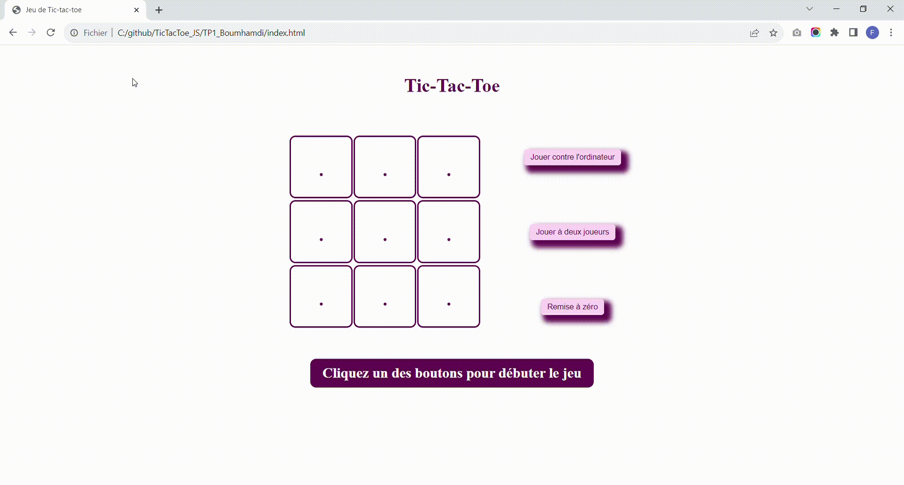

# Tic-Tac-Toe-Game
This is a Tic-Tac-Toe game developed using Javascript/JQuery, HTML5 and CSS3.

## Objective of the game:

The goal of the game is to align three of your symbols (X or O) horizontally, vertically or diagonally on a 3x3 grid.

## Material :

A game grid of 3x3 squares.

Two players, each represented by a distinct symbol (X or O).

## Game progress:

- The first player places his symbol (X or O) in a square on the grid.

- Players take turns placing their symbol in an empty space.

- The game continues until a player manages to line up three of their symbols consecutively (horizontally, vertically or diagonally), or until the grid is filled without any player reaching the condition of victory.

- If one of the players manages to line up three of their symbols, they win the game.

- If the grid is filled without aligning three symbols, the game is declared void.

## Special rules:

- If the grid is filled without any player having lined up three symbols, the game is declared void.

- It is not possible to place a symbol in a space that is already occupied.

## Install

1. Clone this repository on your local machine:

   git clone https://github.com/boumhamdifatima/Tic-Tac-Toe-Game.git

2. Open index.html file in your browser.

## Demonstration

## Contribute

If you would like to contribute to this project, please follow these steps:

   Fork the project
   
   Create a new branch (git checkout -b feature/new-feature)
   
   Make changes and add features
   
   Commit changes (git commit -am 'Add new feature')
   
   Push changes to the branch (git push origin feature/new-feature)
   
   Create a new Pull Request 

## Author 

Fatima Boumhamdi - @FatimaBoumhamdi 

## License 

This project is licensed under the MIT License - see the LICENSE file for details.